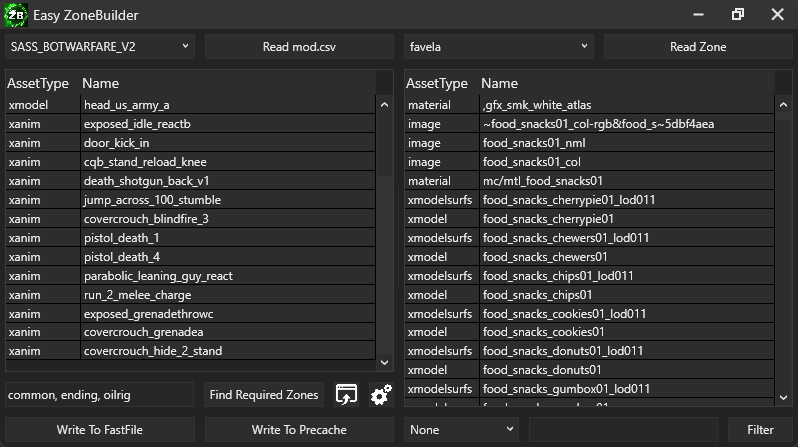

<h1 align="center">
  <br>
  Easy ZoneBuilder
  <br>
</h1>

<div align="center">
  <a href="https://github.com/kruumy/EasyZoneBuilder-iw4/releases"></a>
  <a href="https://github.com/kruumy/EasyZoneBuilder-iw4/releases""></a>
  <a href="https://paypal.me/JPauls281"></a>
</div>

<h4 align="center">Build zones fast</h4>

<div align="center">
  <a href="preview.png">
    
  </a>
</div>

### Repository Structure
```
ActorConsole-Rewritten-iw4
├── ActorConsole.Core
│   ├── Core Functionality.
├── ActorConsole.GUI
│   ├── WPF Front-end.
```
